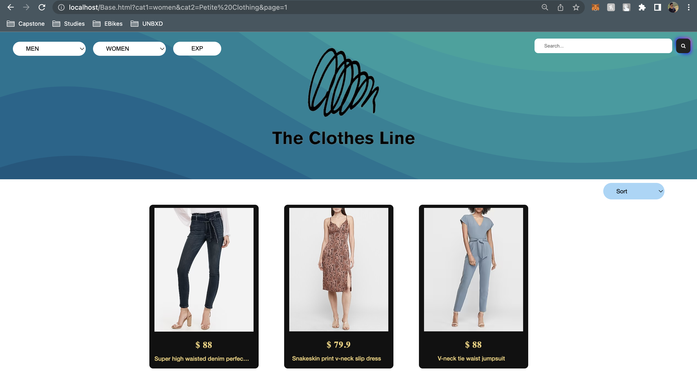
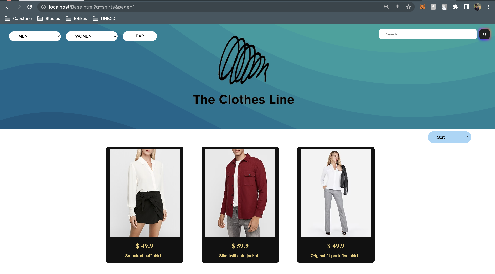
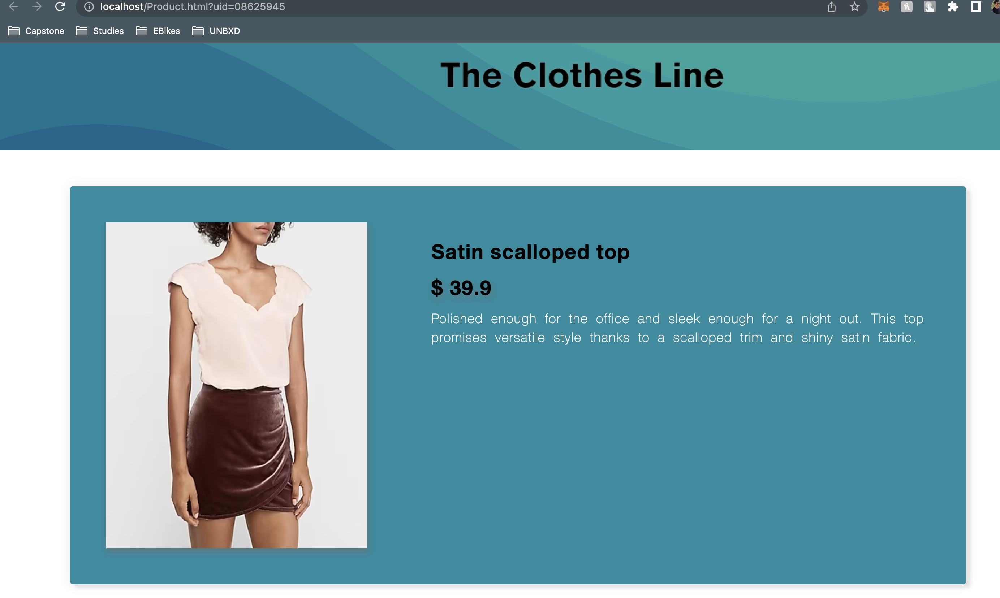

# unbxd_team7
Assignment briefing: https://docs.google.com/document/d/1x1ZnGbpnZDiuCTA8oWP1pvXK1Hdzw8XUlDzdjw5zQKM/edit?usp=sharing <br>
Design document: https://docs.google.com/document/d/1Mp1Vo7OnLveeC7cfIkHc3Lhp2cZCQvZFSeLbucDRczY/edit?usp=sharing <br>
<hr/>

# Summary
This repository contains the code used to build a simple e-commerce website for 'The Clothes Line', a small business which sells apparels and deploying it using Kubernetes. The website allows users to browse and view the products online, sort according to categories and subcategories of products, price and releveance. From a vendor's perspective, products can be seamlessly inserted into the catalog. In addition to being fault tolerant, the website is able to handle 50 requests per second with minimal CPU footprint. 

Tech stack:
- Frontend: HTML, CSS, JS
- Backend: Python flask framework
- Database: Postgres
- Cache: Redis
- Packaging: Docker and Kubernetes
- External API: UNBXD Search API to render search results and product information 


# API specs.

## Category API
Endpoint to fetch all the subcategory names
```
GET-
GET /catalog HTTP/1.1
Host: theclothesline.info
```
Endpoint to fetch all products belonging to a category
```
GET-
GET /category/category1-details/{category1Name}?page=*&sort=* HTTP/1.1
Host: theclothesline.info
```

Endpoint to fetch all products belonging to a subcategory
```
GET-
GET /category/category2-details/{category1Name}/{category2Name}?page=*&sort=* HTTP/1.1
Host: theclothesline.info
```

## Product API
Endpoint to fetch details about a single product from the search API
```
GET-
GET /product/search/{uniqueId}  HTTP/1.1
Host: theclothesline.info
```
Endpoint to fetch details about a single product from the database
```
GET-
GET /product/catalog/{uniqueId}  HTTP/1.1
Host: theclothesline.info
```


## Search API
Endpoint to fetch product search results from the UNBXD search API
```
GET-
GET /search?page=*&sort=* HTTP/1.1
Host: theclothesline.info
```

## Ingestion API
Endpoint to push product details to the database
```
POST-
POST /ingestion HTTP/1.1
Host: theclothesline.info
```
<hr/>

#### Link to Postman Collection

<href> https://api.postman.com/collections/25349504-f0792e7e-0442-4618-aff8-f4fab673bd75?access_key=PMAT-01GRJTEBM237FVH59HY4Z2J39K <href/>

<hr/>

# Sample env file
```
.env
CACHE_TYPE=redis
CACHE_REDIS_HOST=redis
CACHE_REDIS_PORT=6379
CACHE_REDIS_DB=0
CACHE_REDIS_URL=redis://redis:6379/0
CACHE_DEFAULT_TIMEOUT=500
```


# Docker Installation Instruction
To run backend:
- Go to the 'backend' folder
- Run: `docker-compose up -d --build`
- On terminal run this command for data ingestion into database :
        ```curl http://127.0.0.1:5002/ingestion -d @out.json -H "Content-Type: application/json```


To run frontend:
- Go to the 'frontend' folder
- Build frontend image and run it:
```
- docker build -t <name>:v1 . 
- docker run -d -p 80:80 <name>:v1
```

# Running the Services
### Frontend Service
- After installation the frontend docker image will be visible on the docker desktop application. Else one can use <href>http://localhost:80 </href> to access the frontend

### Backend/ Data Ingestion Service
- For ingesting data, a post request containing the product(s) data in "json" format has to be sent to <href>http://localhost:5002/ingestion</href>. 
Use  ```curl http://127.0.0.1:5002/ingestion -d @out.json -H "Content-Type: application/json``` to upload data to the database using terminal.


# APP running
#### Home Page

<hr/>

#### Category Page

<hr/>

#### Search Page

<hr/>

#### Search Page along with sort

<hr/>

#### Product Page

<hr/>

# FAQ
- 